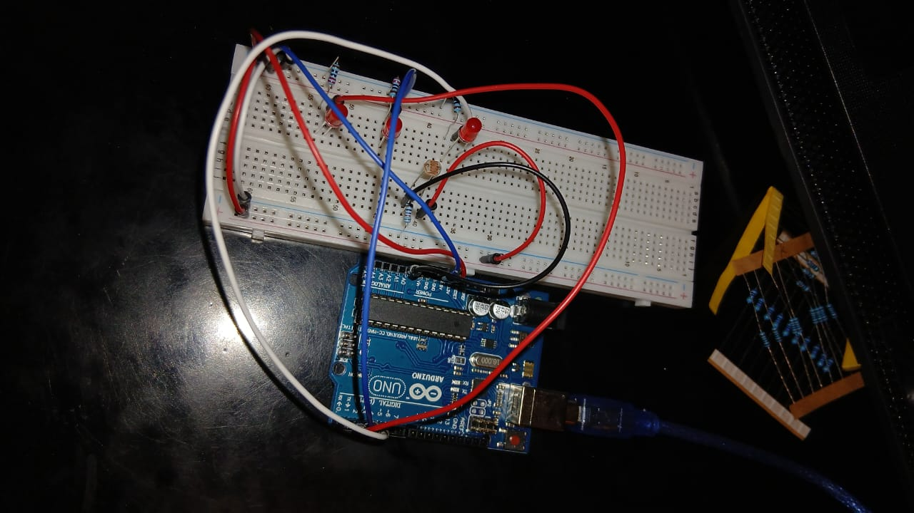

# Touch Sensor LED Control ✋ 



## 📌 Overview
This project is a **Touch Sensor LED Control** system that detects touch using an analog sensor and lights up LEDs accordingly. The sensor readings influence the LED states, creating a dynamic lighting response.

## 🔍 How It Works
- The analog sensor detects touch and provides varying analog values.
- LEDs light up sequentially based on touch count and sensor readings.
- Each touch increases the threshold for activation, adjusting the required analog value.
- When all LEDs are on, the system resets after the next touch.
- Serial monitor displays real-time analog values and touch count updates.

## 🎯 Applications
- Interactive lighting systems
- Touch-sensitive control interfaces
- Sensor-based input devices

## 📌 Future Improvements
- Fine-tune sensitivity for more precise touch detection.
- Implement a debounce mechanism to prevent accidental touches.
- Expand LED patterns for enhanced visual effects.

📢 Feel free to contribute or modify the project! 🛠️✨

## 🛠️ Components Used
- **Arduino Board**
- **Analog Touch Sensor**
- **LEDs (x3)**
- **Resistors**
- **Jumper Wires**
- **Breadboard**

## 📜 Code
```cpp
#define led1 2
#define led2 3
#define led3 4
#define nolight1 300
#define nolight2 380
#define nolight3 450

int analog_value = 0;
int touch_count = 0;
bool touched = false;

void setup() {
  Serial.begin(9600);

  for (int i = led1; i <= led3; i++) {
    pinMode(i, OUTPUT);
    digitalWrite(i, LOW);
  }

  pinMode(A0, INPUT);
}

void loop() {
  analog_value = analogRead(A0);
  Serial.print("Analog value: ");
  Serial.println(analog_value);

  if (analog_value <= nolight1 && !touched && touch_count == 0) {
    touched = true;
    touch_count += 1;

    Serial.println("Touched 1 time");
    Serial.println(analog_value);
    digitalWrite(led1, HIGH);
    delay(200);
  } 
  else if (analog_value <= nolight2 && !touched && touch_count == 1) {
    touched = true;
    touch_count += 1;

    Serial.println("Touched 2 times");
    Serial.println(analog_value);
    digitalWrite(led2, HIGH);
    delay(200);
  } 
  else if (analog_value <= nolight3 && !touched && touch_count == 2) {
    touched = true;
    touch_count += 1;

    Serial.println("Touched 3 times");
    Serial.println(analog_value);
    digitalWrite(led3, HIGH);
    delay(200);
  } 
  else if (analog_value > nolight3) {
    touched = false; 
  }

  else if (analog_value <= nolight3 && !touched && touch_count == 3) {

    Serial.println("Resetting...");
    for (int i = led1; i <= led3; i++) {
      digitalWrite(i, 0);
    }
    touch_count = 0;
    delay(400);
  } 
}
